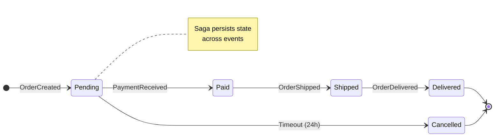
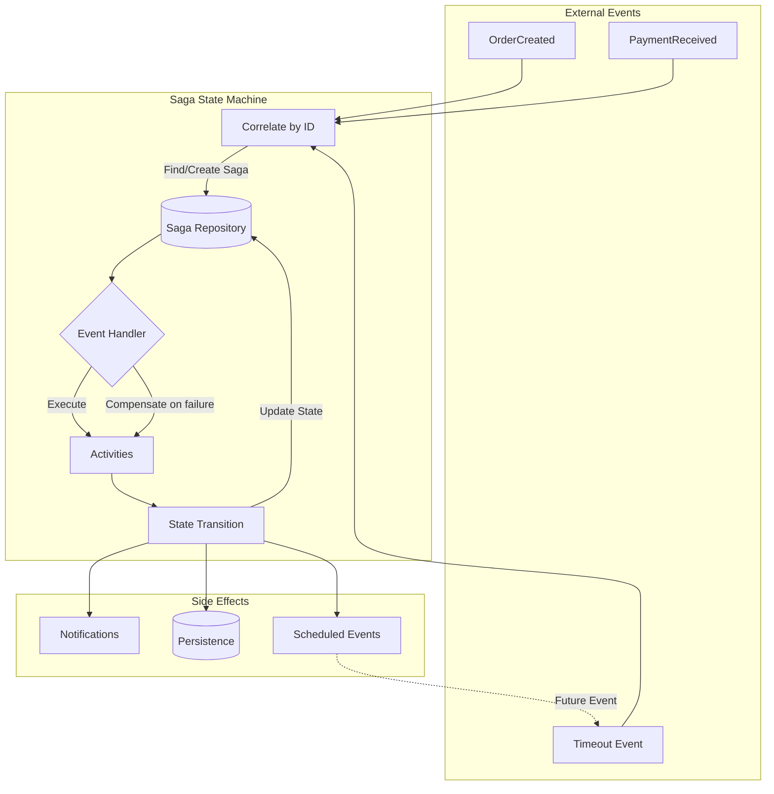

# saga_state_machine

[](https://pub.dev/packages/saga_state_machine)
[](https://opensource.org/licenses/MIT)

A **MassTransit-style saga state machine** framework for Dart and Flutter. This package brings the powerful, declarative state machine pattern from [MassTransit](https://masstransit.io/documentation/patterns/saga/state-machine) to the Dart ecosystem.

## What is a Saga State Machine?

A **saga** is a long-running process that coordinates multiple events over time. Unlike simple state machines, sagas:

- **Persist state** across multiple events (order processing, call management, workflows)
- **Correlate events** to the correct instance using a unique identifier
- **Handle timeouts** automatically when states exceed time limits
- **Support compensation** (rollback) when things go wrong

This pattern is widely used in distributed systems, microservices, and event-driven architectures. MassTransit popularized this approach in the .NET ecosystem, and `saga_state_machine` brings the same declarative API to Dart.

### State Transition Example

The following diagram shows an order processing saga with state transitions, events, and automatic timeout handling:



### Architecture Overview

This diagram illustrates how events flow through the saga state machine:



**Key Concepts:**

1. **Event Correlation** - Events are routed to the correct saga instance by ID
2. **Saga Repository** - Persists saga state (in-memory by default, pluggable)
3. **Event Handlers** - Process events based on current state
4. **Activities** - Execute side effects with optional compensation (rollback)
5. **State Transitions** - Move saga to new state, trigger side effects
6. **Scheduled Events** - Support timeouts and delayed event dispatch

## Features

- **Declarative API**: Define state machines in a readable, self-documenting way
- **Event Correlation**: Automatically route events to the correct saga instance by ID
- **Fluent Builder**: Chain methods like `.set()`, `.transitionTo()`, `.finalize()`
- **Activities**: Execute side effects with optional compensation (rollback)
- **Timeouts**: Built-in timeout handling for states with automatic transitions
- **Finalization**: Clean up resources when saga completes
- **Pluggable Storage**: Default in-memory repository, easily replaceable with custom persistence

## Installation

```yaml
dependencies:
  saga_state_machine: ^1.1.2
```

## Quick Start

### Define your Saga

```dart
enum OrderStatus { pending, paid, shipped, delivered, cancelled }

class OrderSaga extends Saga {
  String? customerId;
  double amount = 0;
  OrderStatus status = OrderStatus.pending;
}
```

### Define Events

```dart
class OrderCreated {
  final String orderId;
  final String customerId;
  final double amount;
  OrderCreated(this.orderId, this.customerId, this.amount);
}

class PaymentReceived {
  final String orderId;
  PaymentReceived(this.orderId);
}
```

### Create the State Machine

```dart
class OrderStateMachine extends SagaStateMachine<OrderSaga, OrderStatus> {
  OrderStateMachine() {
    // Correlate events to sagas
    correlate<OrderCreated>((e) => e.orderId);
    correlate<PaymentReceived>((e) => e.orderId);

    // Initial state
    initially(
      when<OrderCreated>()
        .set((saga, e) => saga
          ..customerId = e.customerId
          ..amount = e.amount)
        .transitionTo(OrderStatus.pending),
    );

    // State handlers
    during(OrderStatus.pending,
      when<PaymentReceived>().transitionTo(OrderStatus.paid),
      timeout(Duration(hours: 24), transitionTo: OrderStatus.cancelled),
    );
  }

  @override
  OrderSaga createSaga(String id) => OrderSaga()..id = id;

  @override
  OrderStatus getState(OrderSaga saga) => saga.status;

  @override
  void setState(OrderSaga saga, OrderStatus state) => saga.status = state;
}
```

### Use It

```dart
final machine = OrderStateMachine();

// Dispatch events
await machine.dispatch(OrderCreated('order-1', 'customer-1', 99.99));
await machine.dispatch(PaymentReceived('order-1'));

// Query saga
final order = machine.getSaga('order-1');
print(order?.status); // OrderStatus.paid
```

## API Reference

### State Machine Methods

| Method                             | Description                                |
| ---------------------------------- | ------------------------------------------ |
| `correlate<E>((e) => id)`          | Define event correlation                   |
| `initially(when<E>()...)`          | Handle new saga creation                   |
| `during(state, when<E>()...)`      | Handle events in specific state            |
| `duringAny(when<E>()...)`          | Handle events in any state                 |
| `timeout(duration, transitionTo:)` | State timeout                              |
| `whenFinalized(execute:)`          | Cleanup on saga completion                 |
| `onAnyTransition(callback)`        | Listen to all state transitions            |
| `onSagaUpdated(callback)`          | Listen to property changes (no transition) |
| `onSagaFinalized(callback)`        | Listen to saga finalization                |

### Event Handler Methods

| Method                   | Description                   |
| ------------------------ | ----------------------------- |
| `when<E>()`              | Create handler for event type |
| `.where((e) => bool)`    | Filter events                 |
| `.set((saga, e) => ...)` | Set saga properties           |
| `.then((ctx) => ...)`    | Execute custom action         |
| `.execute(Activity)`     | Execute activity              |
| `.transitionTo(state)`   | Transition to state           |
| `.finalize()`            | Mark saga as complete         |
| `.schedule<E>(duration)` | Schedule delayed event        |
| `.unschedule<E>()`       | Cancel scheduled event        |

## Comparison with MassTransit

This package is designed to mirror the MassTransit saga state machine API as closely as possible in Dart:

| Feature            | MassTransit (C#)                | saga_state_machine                |
| ------------------ | ------------------------------- | --------------------------------- |
| Declarative DSL    | ✅ `Initially()`, `During()`    | ✅ `initially()`, `during()`      |
| Event correlation  | ✅ `CorrelateById()`            | ✅ `correlate<E>()`               |
| State transitions  | ✅ `TransitionTo()`             | ✅ `.transitionTo()`              |
| Timeouts           | ✅ `Schedule()`, `Unschedule()` | ✅ `.schedule()`, `.unschedule()` |
| Activities         | ✅ `Activity<T>`                | ✅ `Activity<TSaga, TEvent>`      |
| Compensation       | ✅ `Compensate()`               | ✅ `compensate()`                 |
| Finalization       | ✅ `Finalize()`                 | ✅ `.finalize()`                  |
| Any state handlers | ✅ `DuringAny()`                | ✅ `duringAny()`                  |
| Persistence        | RabbitMQ, SQL, Redis, MongoDB   | In-memory (pluggable interface)   |

### MassTransit C# Example

```csharp
public class OrderStateMachine : MassTransitStateMachine<OrderState>
{
    public OrderStateMachine()
    {
        Initially(
            When(OrderSubmitted)
                .Then(context => context.Saga.CustomerId = context.Message.CustomerId)
                .TransitionTo(Submitted));

        During(Submitted,
            When(PaymentReceived)
                .TransitionTo(Paid),
            When(OrderCancelled)
                .TransitionTo(Cancelled)
                .Finalize());
    }
}
```

### Equivalent saga_state_machine Dart Code

```dart
class OrderStateMachine extends SagaStateMachine<OrderSaga, OrderStatus> {
  OrderStateMachine() {
    initially(
      when<OrderSubmitted>()
        .set((saga, e) => saga.customerId = e.customerId)
        .transitionTo(OrderStatus.submitted));

    during(OrderStatus.submitted,
      when<PaymentReceived>().transitionTo(OrderStatus.paid),
      [when<OrderCancelled>().transitionTo(OrderStatus.cancelled).finalize()]);
  }
}
```

## Use Cases

- **Order Processing**: Track orders through submitted → paid → shipped → delivered
- **VoIP Call Management**: Manage call states (ringing, answered, on hold, completed)
- **Booking Systems**: Handle reservations with timeouts and cancellations
- **Workflow Orchestration**: Coordinate multi-step business processes
- **IoT Device States**: Track device lifecycle and connectivity states

## Advanced Features

### Custom Activities

```dart
class SendEmailActivity extends Activity<OrderSaga, OrderCompleted> {
  @override
  Future<void> execute(BehaviorContext<OrderSaga, OrderCompleted> context) async {
    await emailService.sendOrderConfirmation(context.saga.email);
  }

  @override
  Future<void> compensate(BehaviorContext<OrderSaga, OrderCompleted> context) async {
    await emailService.sendOrderCancellation(context.saga.email);
  }
}
```

### Custom Repository

```dart
class PostgresSagaRepository extends SagaRepository<OrderSaga> {
  @override
  OrderSaga? getById(String id) => // fetch from database

  @override
  void save(OrderSaga saga) => // persist to database
}

// Use it
machine.useRepository(PostgresSagaRepository());
```

### Property Updates Without State Transitions

Sometimes you need to update saga properties without changing state (e.g., mute toggle, duration updates). Use handlers with `.set()` but no `.transitionTo()`:

```dart
during(CallStatus.connected, [
  // These update properties but don't change state
  when<MuteToggled>().set((saga, e) => saga.isMuted = e.isMuted),
  when<DurationUpdated>().set((saga, e) => saga.duration = e.duration),
]);

// Listen to property-only changes
machine.onSagaUpdated((saga) {
  print('Saga updated: ${saga.isMuted}, ${saga.duration}');
});
```

This follows the MassTransit pattern where `.Set()` / `.Then()` without `TransitionTo()` still persists and notifies changes.

## Inspiration & Attribution

This package is directly inspired by [MassTransit](https://masstransit.io/)'s excellent saga state machine implementation for .NET, created by Chris Patterson. The API design closely follows MassTransit's patterns to provide a familiar experience for developers coming from the .NET ecosystem.

- [MassTransit Documentation](https://masstransit.io/documentation/patterns/saga/state-machine)
- [MassTransit GitHub](https://github.com/MassTransit/MassTransit)

MassTransit is a trademark of Chris Patterson. This package is not affiliated with or endorsed by MassTransit.

## Contributing

Contributions are welcome! Please feel free to submit issues and pull requests.

## Contributors

Thanks to the contributors who have helped improve this project.

<table>
  <tr>
    <td align="center">
      <a href="https://github.com/lucaslannes">
        
        <br />
        <sub><b>@lucaslannes</b></sub>
      </a>
      <br />
      <a href="https://github.com/speed1057/saga_state_machine/commits?author=lucaslannes" title="Code">💻</a>
      <a href="https://github.com/speed1057/saga_state_machine/commit/dec9efb" title="Tests">⚠️</a>
    </td>
  </tr>
</table>

## License

MIT License - see [LICENSE](LICENSE) for details.
